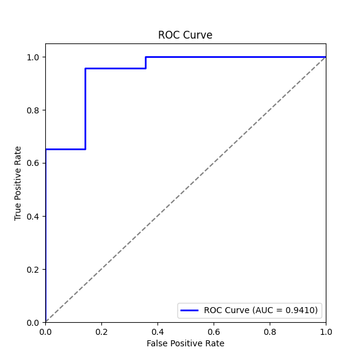
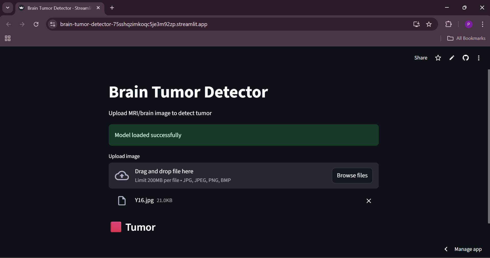

# 🧠 Brain Tumor Detection using MobileNetV2

Brain tumors are abnormal growths of cells in the brain, which can be life-threatening if not detected early. Early diagnosis through MRI scans can significantly improve treatment outcomes and save lives. This project uses **deep learning** to automatically classify MRI images as **tumor** or **no tumor**, making detection faster and more reliable.

---

## 🔑 Key Features

1. **Data Augmentation** → Increase dataset size and robustness  
2. **MobileNetV2** → Lightweight and efficient model for feature extraction  
3. **Fast and Accurate** → Optimized for small datasets and quick training  
4. **Retaining Best Model** → ModelCheckpoint ensures the best weights are saved  
5. **Early Stopping** → Prevents overfitting and saves training time  
6. **Cross-Validation** → (Optional) Ensures model generalizes well across splits  

---

## 🛠 Tech Stack

**Deep Learning & Model:** TensorFlow, Keras, MobileNetV2  
**Data Processing:** NumPy, OpenCV, Pillow  
**Visualization:** Matplotlib, Seaborn  
**Deployment (Optional):** Streamlit  
**Other:** Python 3.8+, os, shutil, pathlib  

---

## 📂 Dataset  

The dataset consists of **MRI scans of patients** for brain tumor detection.  

#### Categories:

- **Yes** → 155 MRI images (Tumor present)  
- **No** → 98 MRI images (No tumor)  

Dataset source: [Kaggle - Brain MRI Images for Brain Tumor Detection](https://www.kaggle.com/datasets/navoneel/brain-mri-images-for-brain-tumor-detection)  

These MRI images are relatively small in size, making them suitable for training lightweight deep learning models like **MobileNetV2**.  

---

## 🔄 Workflow

1. Fetch dataset  
2. Preprocess images (cropping, resizing to 224×224)  
3. Data augmentation (rotation, shift, zoom, flip, brightness adjustment)  
4. Split dataset into **train/validation/test**  
5. Train **MobileNetV2** model with custom classifier head  
6. Save and retain the best model  
7. Use the model for predictions  
8. (Optional) Deploy interactive interface using **Streamlit**  

---

## 📈 Accuracy

**Training Accuracy:** 94.6%  
**Validation Accuracy:** 91.9%  

**ROC Curve**:

**Streamlit Demo**:

---

## ✍️ Author

**Pravallika Sesha Sai Nunna**
